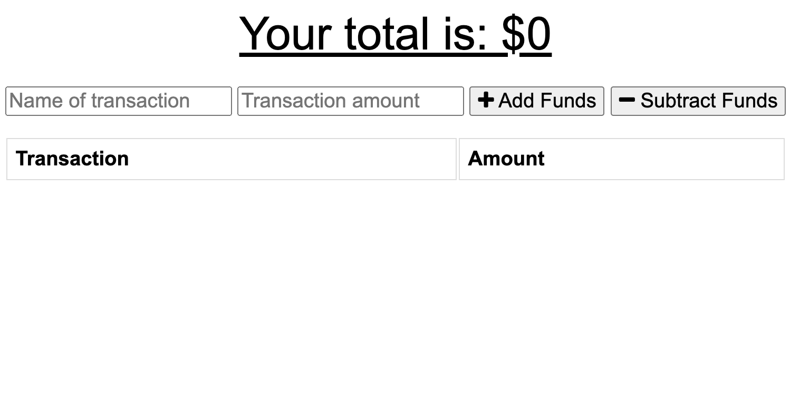
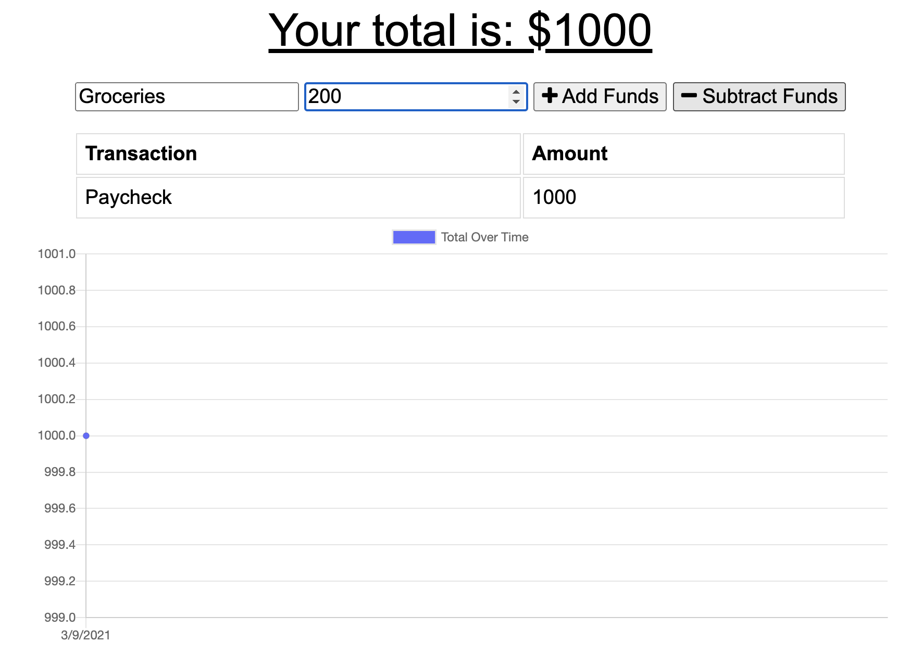
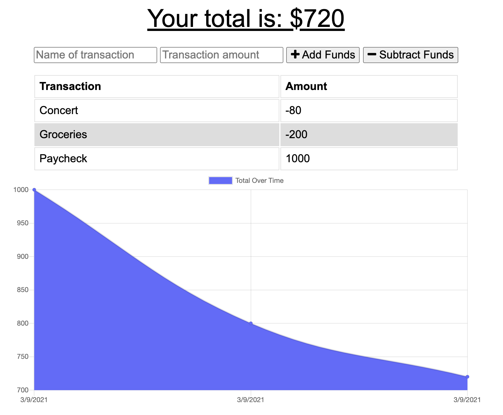

# Online-Offline-Budget-Trackers

## Description

This is a progressive web application (PWA) that allows the user to track their budget transactions whether they are on or offline. When the user is offline, their transactions are stored in indexedDB and then moved to the database when they come online again.

## Live Site

[Click Here](https://gentle-everglades-71562.herokuapp.com/)

## Instructions

1) Type in the name and amount of your transaction in the appropriate fields

2) Submit your transaction as either a revenue (` + Add Funds `) or expense (` - Subtract Funds `)

## Installation

* If using app, run `npm install` in command line of terminal for the directory
* After that, run `npm start` and click on the link provided in the console.
* Otherwise, use the [Heroku link](https://gentle-everglades-71562.herokuapp.com/)

## Screenshots

Startup Page:

Inputting a transaction:

Dynamic Chart:

## Technologies Used

- HTML
- CSS
- Javascript
- Heroku
- AtlasDB
- MongoDB
- Express
- Chart.js
- Mongoose

## Questions

For any questions, please contact me at:

**Email:** calebhopkins@outlook.com

**GitHub Profile:** [CalebTheCreative]("https://github.com/CalebTheCreative")